# kdae-panel

`kdae-panel` 是面向 [dae](https://github.com/daeuniverse/dae) 及其兼容分支的零侵入式 Web 管理面板。

面板不引用 dae 的内部 Go 包，也不读取其内部 eBPF Map。它只依赖 dae 的公开命令、`.dae` 配置文件，以及系统的服务与日志接口（systemd/journald 或 OpenWrt 的 procd/logread），因此 dae 内部重构、协议实现变化和普通配置字段新增通常不需要同步修改面板。

## 界面预览

| 运行概览 | 代理编排 |
| :--: | :--: |
| 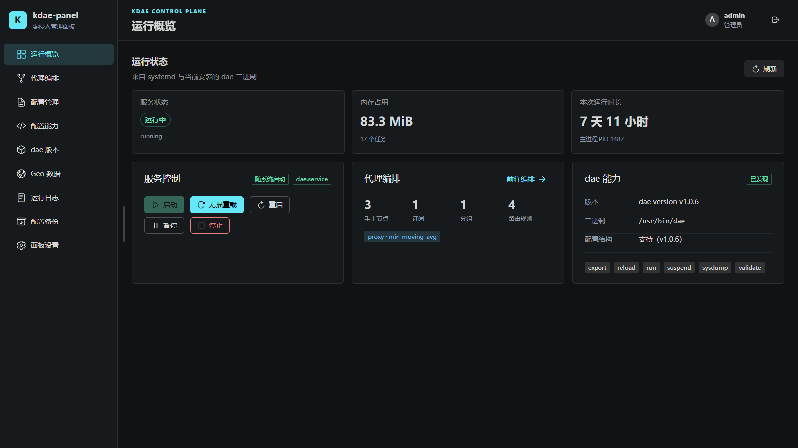 | 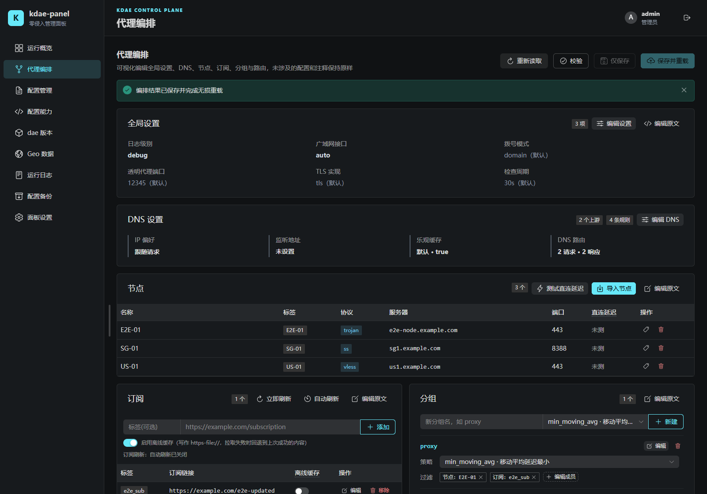 |

| 配置管理 | 动态配置能力 |
| :--: | :--: |
| 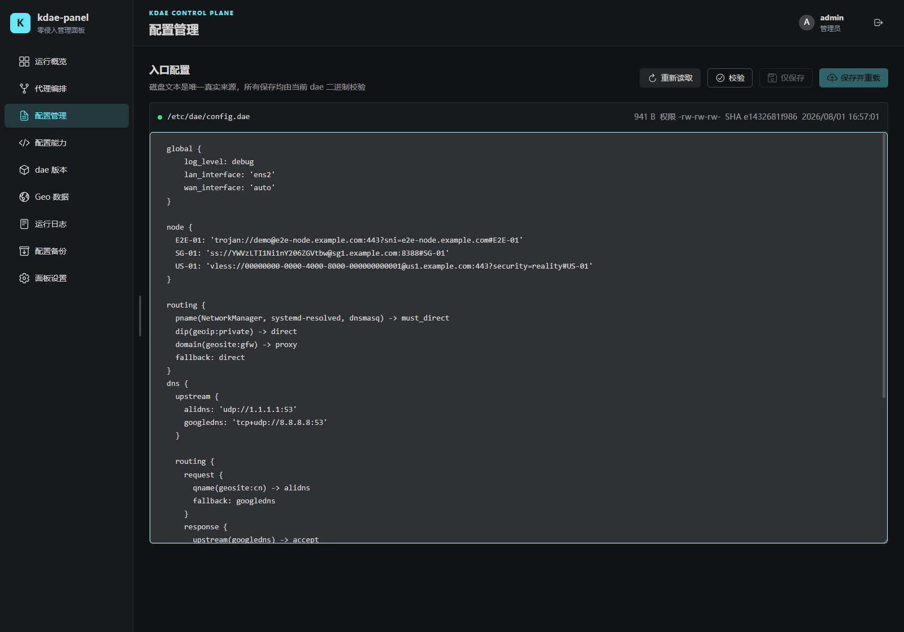 | 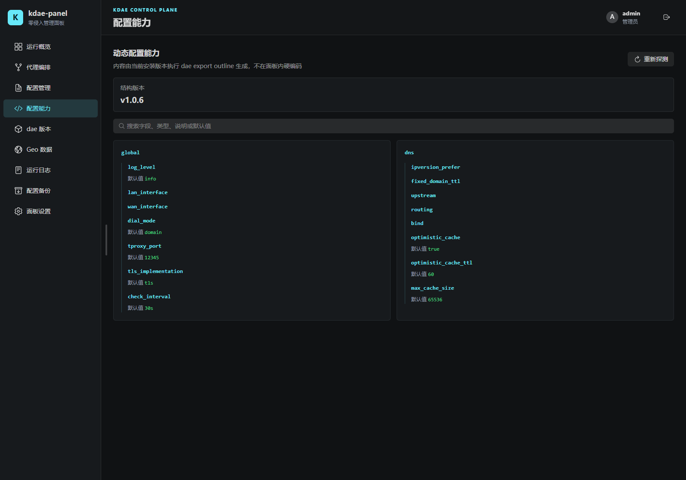 |

| dae 版本管理 | Geo 数据管理 |
| :--: | :--: |
| 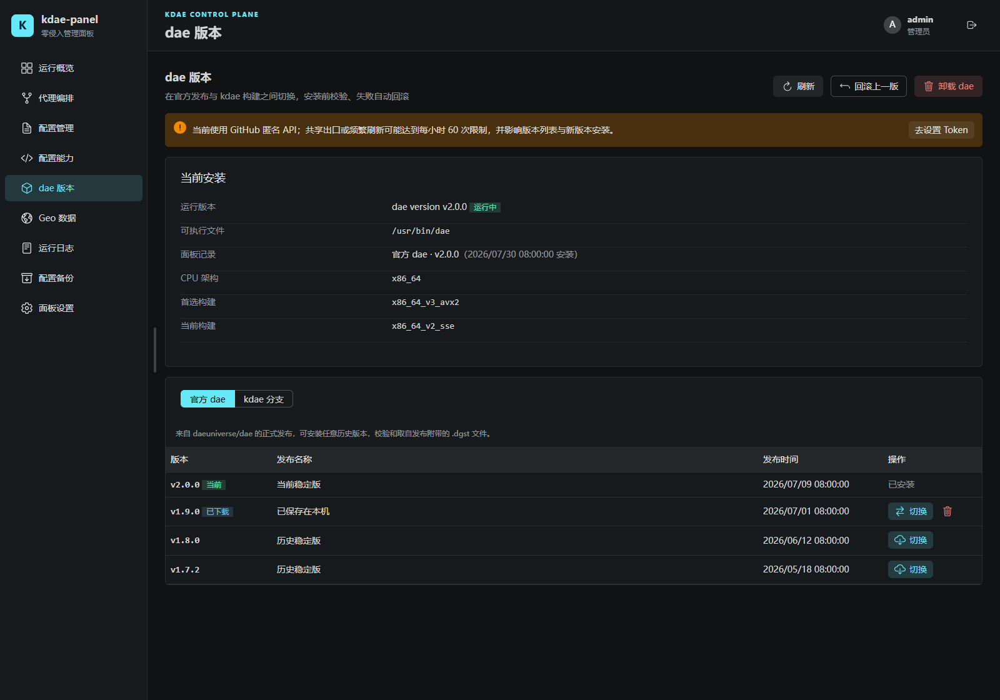 | 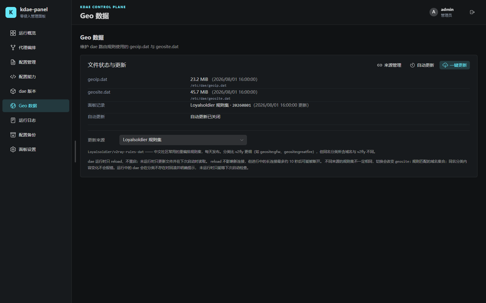 |

| 故障诊断 | 运行日志 |
| :--: | :--: |
| 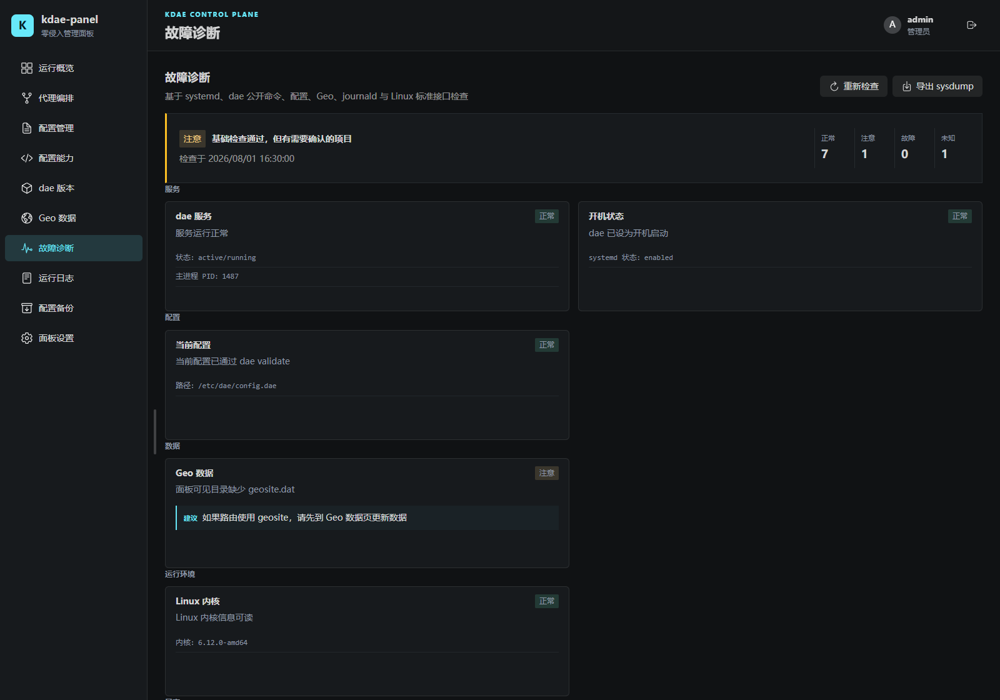 | 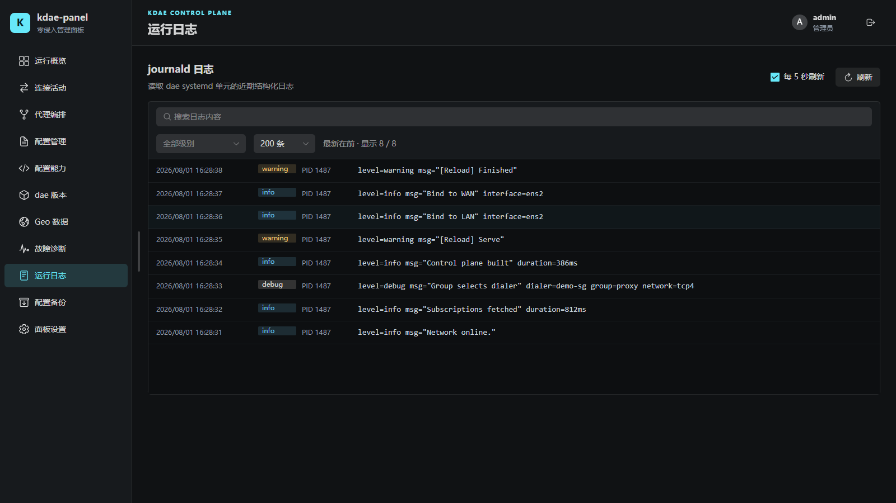 |

| 连接活动 | |
| :--: | :--: |
| 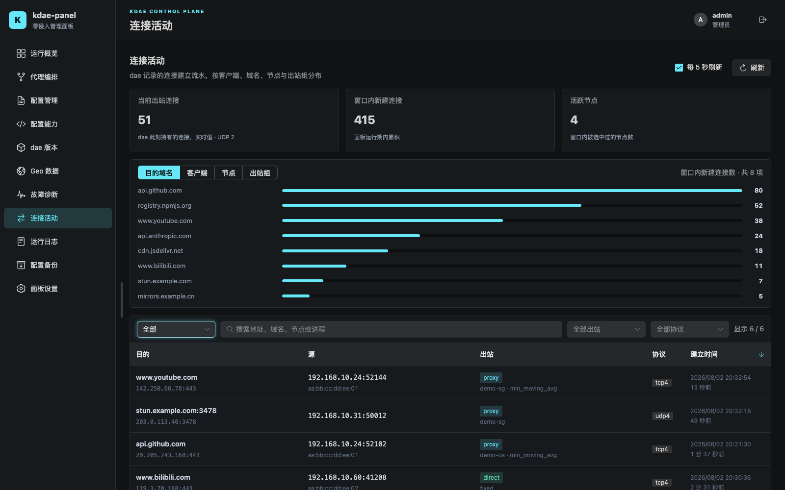 | |

| 配置备份 | 面板设置 |
| :--: | :--: |
| 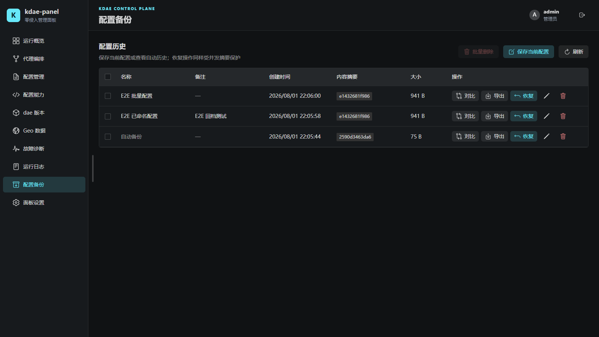 | 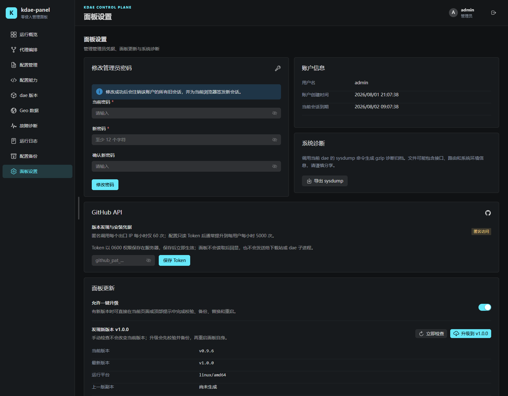 |

| 首次设置 | 登录 |
| :--: | :--: |
| 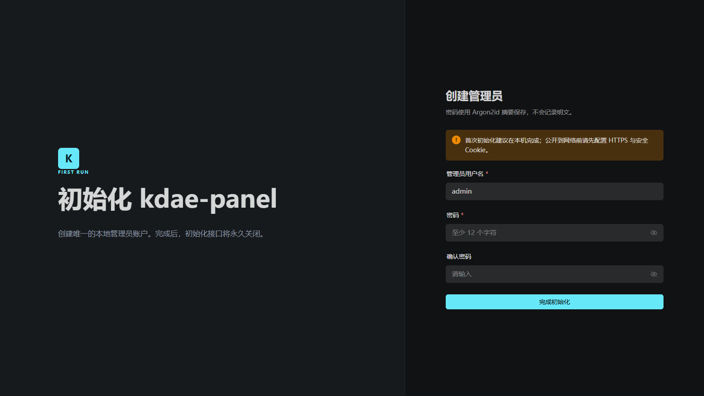 |  |

*截图由 v1.0.0 当前代码的 Playwright 演示环境生成，页面状态、节点、订阅、日志、诊断与延迟均为示例数据。*

## 功能

- 通过 `dae export outline` 动态发现当前版本的配置结构；
- systemd 与 OpenWrt procd 两套服务后端，自动探测；服务状态、运行时长、启动、停止和重启；面板启动 dae 时同步设为随系统启动，停止时同步取消，系统重启后保持最后一次面板控制的状态；
- dae 无损重载、暂停和 sysdump 诊断；
- `global`、DNS、节点、订阅、分组与路由的可视化编排：全局设置与 DNS 覆盖 dae 当前公开的字段，实际支持项和默认值由本机二进制的 `export outline` 动态确认，不兼容字段会明确标记；DNS 提供上游、请求/响应路由、缓存、监听地址和固定 TTL 编辑，以及彼此独立的简单/进阶草稿；同时支持分享链接批量导入并自动生成稳定节点标签、导入时加入已有分组、按本地节点、订阅节点或整份订阅维护分组成员、逐条路由编辑，以及 GFW/中国列表/全局/MAC 常用路由模板；复杂内容可直接在当前页面编辑对应节原文，注释与未涉及的配置节保持不变；
- 订阅离线缓存开关（dae 的 `-file` 持久化）、立即刷新与按间隔自动刷新；
- 在官方 dae 发布与 kdae 分支 CI 构建之间安装、切换、回滚或卸载；切换前可用目标二进制预检 ELF、版本、公开命令及当前配置兼容性，不替换文件或控制服务；安装事务仍会再次校验并在失败时自动恢复；下载过的二进制会保存在本地版本库，后续切换无需联网，并可逐个清理；机器上没有 dae 时可完成首次安装，卸载时可分别选择保留或删除配置与 geo 数据（默认保留，版本管理默认开启）；GitHub 元数据带短时缓存与并发合并，设置页可安全填写只读 Token 以避开匿名接口低额度；
- 独立的 Geo 数据管理页：一键更新、文件状态与路径、异常事务恢复、每天到每 30 天的定时更新；内置 Loyalsoldier 与 v2fly，也可保存多组自定义公网 HTTPS 直链；两个文件逐一校验 SHA-256，即使分处不同目录也各自原位更新并共同回滚，运行中按服务后端记录的 PID reload，未运行则在下次启动时生效，来源沿用上次且绝不静默切换规则集；
- 面板自身的新版本提醒：读取本仓库最新发布并长时缓存，设置页支持立即检查；
- 节点入口延迟探测：公网使用不经过 dae TCP/UDP 转发的 ICMP 三次中位数，内网使用 TCP；不靠延迟阈值猜测，也不以可能经过当前代理的结果兜底；
- 原始配置编辑、独立校验、并发冲突检测和事务保存；
- 保存前备份、原子替换及重载失败后的磁盘回滚；
- 配置历史存档：可为当前配置保存名称和备注，恢复前展示与当前配置的逐行差异，并用当前 dae 预先校验兼容性；不兼容存档禁止恢复，真正恢复时仍再次校验并受乐观锁保护；存档支持原文导出、单份删除和多选批量删除，自动备份仍按 50 份、256 MiB 上限自动清理；
- 故障诊断中心：聚合服务状态、dae 公开能力、当前配置校验、Geo 文件、网络接口、默认路由、Linux 内核、eBPF 基础条件与近期异常日志；结论与修复建议按当前服务后端给出；单项探测失败不会中断整份报告，正常 reload 生命周期日志不会被误报为故障；
- 结构化日志浏览、搜索和级别筛选；
- 连接活动面板：dae info 级别的连接建立流水（源、目的、嗅探域名、出站、节点、进程与 MAC），按时间窗筛选、可点表头双向排序；同时按目的域名、客户端（带 MAC）、节点与出站组给出分布，并显示 dae 当前扛着多少条出站连接。逐条连接的存活状态与流量不提供——dae 的 eBPF 数据面把被代理连接的客户端侧完全留在内核，没有任何公开接口能逐条判定（已在真机验证）；
- SQLite 管理员账户、Argon2id 密码摘要和服务端会话；
- SameSite/HttpOnly Cookie、CSRF 校验、同源检查和登录限速；
- Vue 3 响应式管理界面，前端资源嵌入单个 Go 二进制；
- OpenWrt 24.10（ipk）与 25.12（apk）两条版本线，`x86_64`、`aarch64_generic`、`i386_pentium4` 三种架构。

## 安装

本仓库只发 OpenWrt / ImmortalWrt 的软件包，装完 LuCI 里会多出「服务 → kdae 面板」的入口。
Release 附带的产物覆盖两条版本线、三种架构：

| OpenWrt | 包格式 | 架构 |
|---|---|---|
| 24.10 | `.ipk`（opkg） | `x86_64`、`aarch64_generic`、`i386_pentium4` |
| 25.12 | `.apk`（apk） | `x86_64`、`aarch64_generic`、`i386_pentium4` |

不确定自己是哪个架构，在设备上问包管理器：24.10 用 `opkg print-architecture`，25.12 用
`apk --print-arch`。x86 软路由基本都是 `x86_64`，ARM64 设备是 `aarch64_generic`。

下载对应的面板包与 LuCI 包之后：

```sh
# 24.10
opkg install ./kdae-panel_*_x86_64-openwrt-24.10.ipk \
             ./luci-app-kdae-panel_*_all-openwrt-24.10.ipk

# 25.12
apk add --allow-untrusted ./kdae-panel-*-x86_64-openwrt-25.12.apk \
                          ./luci-app-kdae-panel-*-openwrt-25.12.apk
```

包用官方 OpenWrt SDK 构建，同版本同架构的 ImmortalWrt 装的是同一批文件。dae 的可执行文件、
配置与 geo 全部由面板管理，不经 opkg/apk，这样升级软件包不会把你自己的分支构建盖回官方版本；
也因此本包与官方 `dae` 包互斥，装过官方包的机器要先 `opkg remove dae dae-geoip dae-geosite`。

机器上还没有 dae 也可以先装面板，再在版本管理页完成 dae 的首次安装。更多细节、UCI 配置项、
故障排查与真机验证清单见 [docs/openwrt.md](docs/openwrt.md)。

## 首次访问

面板默认监听 `0.0.0.0:2026`，同一局域网内的设备都能访问：

```text
http://<路由器 IP>:2026
```

第一次进去要创建管理员。一次性初始化链接直接显示在 LuCI 的面板页上，点一下就跳过去；也可以在
shell 里读：

```sh
cat /var/run/kdae-panel/setup-url
logread -e kdae-panel
```

多网卡机器可能有好几条，挑当前设备能访问的那条。页面会自动完成授权，注册表单只需填写用户名和
密码。创建管理员后初始化接口永久关闭，交接文件也立即删除。

局域网直连使用明文 HTTP，只适合可信内网；跨不可信网络访问请使用 HTTPS 反向代理或 SSH 隧道。

## 升级与卸载

升级就是安装新版本的软件包，`/etc/config/kdae-panel` 里改过的设置不会被覆盖。卸载：

```sh
opkg remove kdae-panel luci-app-kdae-panel   # 24.10
apk del kdae-panel luci-app-kdae-panel       # 25.12
```

`/etc/kdae-panel`（面板数据）与 `/etc/dae`（dae 配置和 geo 数据）不会被删除，要清干净得手工
`rm -rf`。dae 本身也不受影响。

## 从源码构建

依赖 Go 1.25.12+、Node.js 22+：

```bash
git clone https://github.com/senshinya/luci-app-kdae-panel.git
cd luci-app-kdae-panel
npm ci --prefix web
make build
```

产物是 `bin/kdae-panel`，前端资源已经嵌进去。软件包由 CI 用官方 OpenWrt SDK 打，本地不需要
装 SDK 也能改代码、跑测试。

## 开发

```bash
npm install --prefix web
npm run build --prefix web
go run ./cmd/kdae-panel \
  --database ./data/panel.db \
  --backup-dir ./data/backups \
  --schedule-file ./data/schedule.json \
  --dae-config ./data/config.dae
```

前后端分离开发：

```bash
# 终端一
go run ./cmd/kdae-panel --database ./data/panel.db --schedule-file ./data/schedule.json

# 终端二，Vite 会代理 /api 到 127.0.0.1:2023
npm run dev --prefix web
```

验证全部代码：

```bash
npm run typecheck --prefix web
npm test --prefix web
npm run build --prefix web
go test ./...
go vet ./...
go run golang.org/x/vuln/cmd/govulncheck@v1.1.4 ./...
```

改动前端依赖后，务必先 `rm -rf web/node_modules web/*.tsbuildinfo` 再 `npm ci --prefix web` 复验：`vue-tsc -b` 是增量构建，而 `npm install` 不会删掉已不在 package.json 里的包，两者叠加会让本地 typecheck 用着旧状态通过，到 CI 的干净环境才失败。

`@types/katex` 看起来无人引用，实际是 naive-ui 类型定义的依赖（`config-provider/src/katex.d.ts` 与 `equation/src/Equation.d.ts` 直接 `import 'katex'`）。源码里搜不到它，删掉即 typecheck 失败。

## 上游兼容

面板启动后直接执行当前安装的 dae：

```text
dae --version
dae --help
dae export outline
dae validate -c <候选配置>
dae reload
dae suspend
dae sysdump
```

配置字段和默认值来自 `export outline`，配置正确性以 `validate` 的结果为准。面板不会复制 dae 的完整配置模型，也不会将未知配置字段静默删除。

完全零适配无法覆盖上游主动删除公开命令或改变命令语义的情况。CI 会持续验证面板自身契约；建议对生产环境的 dae 版本进行固定，并在升级前使用新二进制验证现有配置。

仓库的 `kdae 上游兼容` 工作流每周检出并构建 `olicesx/dae:kdae`，使用真实二进制验证能力发现、outline、配置校验和 sysdump 文件契约。上游发生破坏性变化时会直接产生失败记录。

## 文档

- [架构与兼容策略](docs/architecture.md)
- [OpenWrt / ImmortalWrt 部署](docs/openwrt.md)
- [HTTP API](docs/api.md)
- [安全策略](SECURITY.md)

## 许可证

GNU Affero General Public License v3.0，详见 [LICENSE](LICENSE)。
